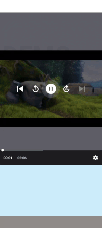

# Building a Smooth Mini Player in Android with MotionLayout

<table>
<tr>
<td style="vertical-align: top; width: 30%;">

## Introduction

In modern media applications, a mini player (or Picture-in-Picture like component) has become an essential UI pattern. Think YouTube, Spotify, or any major streaming app – they all feature a collapsible player that allows users to continue watching/listening while browsing other content. In this article, I'll walk you through how I implemented a smooth, gesture-responsive mini player using Android's MotionLayout.

</td>
<td style="vertical-align: top; width: 70%;">



</td>
</tr>
</table>

## The Challenge

Building a mini player isn't just about shrinking a video player. It involves handling multiple states, smooth transitions, gesture interactions, and maintaining video playback - all while ensuring a seamless user experience. The main challenges include:

1. Managing different player states (Expanded, Collapsed, Mini)
2. Handling smooth transitions between states
3. Implementing gesture recognition for dragging and snapping

## The Solution

I built a solution using Android's MotionLayout combined with ExoPlayer, implementing a state-based architecture. Here's how it works:

### 1. State Management

First, I defined clear states for the player using a sealed class:

```kotlin
sealed class VideoStates(val value: String, val analyticValue: String) {
    class Expanded : VideoStates("Expanded", "EXPANDED")
    class Collapsed : VideoStates("Collapsed", "COLLAPSED")
    class MiniPlayer : VideoStates("MiniPlayer", "MINI_PLAYER")
    
    // Future states
    class Fullscreen : VideoStates("Fullscreen", "FULLSCREEN")
    class PIPMode : VideoStates("PIP", "PIP")
}
```

This approach provides type-safe state management and makes it easy to add new states in the future.

### 2. Custom MotionLayout Implementation

The heart of the implementation is a custom MotionLayout that handles state transitions:

```kotlin
class PlayerScreenMotionLayout @JvmOverloads constructor(
    context: Context, attrs: AttributeSet? = null, defStyleAttr: Int = 0
) : MotionLayout(context, attrs, defStyleAttr), OnScrollDispatcher {

    private var videoPlayerState: VideoStates = VideoStates.Expanded()

    override fun onScrollDown(progress: Float, config: MotionScrollConfig?) {
        if (videoPlayerState is VideoStates.Collapsed) {
            setTransition(R.id.collapsed, R.id.expanded)
            setProgress(progress)
        } else if (videoPlayerState is VideoStates.Expanded) {
            setTransition(R.id.expanded, R.id.miniplayer)
            setProgress(progress)
        }
    }

    override fun onScrollUp(progress: Float, config: MotionScrollConfig?) {
        if (videoPlayerState is VideoStates.Expanded) {
            setTransition(R.id.expanded, R.id.collapsed)
            setProgress(progress)
        }
    }
}
```

### 3. Gesture Handling

For a natural feel, the player responds to both drag and scroll gestures. Here's how the touch listener handles dragging:

```kotlin
class MiniPlayerListener(
    private val parentWidth: Int,
    private val parentHeight: Int,
    private var constraintSet: ConstraintSet?,
) : View.OnTouchListener {
    private var dX = 0f
    private var dY = 0f
    private var startX = 0f
    private var startY = 0f
    private val clickThreshold = 10 // in pixels

    override fun onTouch(view: View, event: MotionEvent): Boolean {
        when (event.action) {
            MotionEvent.ACTION_DOWN -> {
                dX = view.x - event.rawX
                dY = view.y - event.rawY
                startX = event.rawX
                startY = event.rawY
            }
            MotionEvent.ACTION_MOVE -> {
                view.animate()
                    .x(event.rawX + dX)
                    .y(event.rawY + dY)
                    .setDuration(0)
                    .start()
            }
            MotionEvent.ACTION_UP -> {
                snapToNearestCorner(view)
            }
        }
        return true
    }
}
```

### 4. Smart Snapping Behavior

When the user releases the mini player, it smartly snaps to the nearest corner:

```kotlin
private fun snapToNearestCorner(view: View) {
    val midX = parentWidth / 2
    val midY = parentHeight / 2
    
    val paddingPx = TypedValue.applyDimension(
        TypedValue.COMPLEX_UNIT_DIP,
        16f,
        view.resources.displayMetrics
    ).toInt()

    val finalX = if (view.x + view.width / 2 < midX) {
        paddingPx.toFloat()
    } else {
        (parentWidth - view.width - paddingPx).toFloat()
    }

    val finalY = if (view.y + view.height / 2 < midY) {
        paddingPx.toFloat()
    } else {
        (parentHeight - view.height - paddingPx).toFloat()
    }

    view.animate()
        .x(finalX)
        .y(finalY)
        .setDuration(300)
        .start()
}
```

### 5. Scroll Architecture Components

The scroll behavior is managed through several interconnected components:

#### a. OnScrollDispatcher Interface
This interface defines the contract for handling scroll events:

```kotlin
interface OnScrollDispatcher {
    fun onScrollDown(progress: Float, config: MotionScrollConfig?)
    fun onScrollUp(progress: Float, config: MotionScrollConfig?)
    fun onCancelScroll(isDown: Boolean, config: MotionScrollConfig?)
}
```

#### b. MotionScrollConfig
The MotionScrollConfig class proved to be a powerful tool beyond basic scroll behavior configuration, particularly for A/B testing scenarios.
- The lambda-based design of MotionScrollConfig allows for runtime behavior changes.

```kotlin
class MotionScrollConfig(
    val canScrollDown: () -> Boolean = { true },
    val canScrollUp: () -> Boolean = { true },
    val maxDragDistance: Float = DEFAULT_MAX_DRAG_DISTANCE
) {
    companion object {
        const val DEFAULT_MAX_DRAG_DISTANCE = 800f
    }
}
```

#### c. ScrollDispatcherTouchListener
The core component that handles touch events and converts them into scroll actions:

```kotlin
class ScrollDispatcherTouchListener(
    private val gestureDetector: GestureDetector? = null,
    private val config: MotionScrollConfig,
    private val onScrollDispatcher: OnScrollDispatcher
) : View.OnTouchListener {
    private val clickThreshold: Int = 10
    private var startX = 0f
    private var startY: Float? = null
    private var maxDragDistance = config.maxDragDistance

    override fun onTouch(v: View, event: MotionEvent): Boolean {
        gestureDetector?.onTouchEvent(event)
        when (event.action) {
            MotionEvent.ACTION_DOWN -> {
                startX = event.rawX
                startY = event.rawY
            }
            MotionEvent.ACTION_MOVE -> {
                if (startY == null) {
                    startY = event.rawY
                }
                val deltaY = event.rawY - startY!!

                if (deltaY > clickThreshold) {
                    val progress = (deltaY / maxDragDistance).coerceIn(0f, 1f)
                    if (config.canScrollDown()) {
                        onScrollDispatcher.onScrollDown(progress, config)
                    }
                } else if (deltaY < -clickThreshold) {
                    val progress = (-deltaY / maxDragDistance).coerceIn(0f, 1f)
                    if (config.canScrollUp()) {
                        onScrollDispatcher.onScrollUp(progress, config)
                    }
                }
            }
            MotionEvent.ACTION_UP, MotionEvent.ACTION_CANCEL -> {
                handleScrollEnd(v, event)
            }
        }
        return true
    }

    private fun handleScrollEnd(v: View, event: MotionEvent) {
        // Implementation details for handling scroll end
    }
}
```

#### d. bindScrollTo Extension Function
A convenient way to attach scroll behavior to any view:

```kotlin
fun View.bindScrollTo(
    gestureDetector: GestureDetector? = null,
    config: MotionScrollConfig = MotionScrollConfig(),
    dispatcher: OnScrollDispatcher
) {
    val touchListener = ScrollDispatcherTouchListener(
        gestureDetector, 
        config, 
        dispatcher
    )
    this.setOnTouchListener(touchListener)
}
```

### 6. Media Integration

The player fragment handles video playback using ExoPlayer:

```kotlin
private fun initPlayer() {
    val player = ExoPlayer.Builder(requireContext()).build()
    binding.playerView.player = player

    val mediaItem = MediaItem.fromUri(videoUrl.toUri())
    player.setMediaItem(mediaItem)
    player.prepare()
    player.playWhenReady = true
}
```

## Key Technical Decisions

1. **Why MotionLayout?**
   - Built-in support for complex animations
   - Declarative way to define transitions
   - Hardware accelerated performance
   - Integration with the Android constraint system

2. **State Management Approach**
   - Sealed classes for type safety
   - Clear state transitions
   - Easy to extend for future requirements

3. **Gesture Handling**
   - Separate touch listener for mini player mode
   - Combined scroll and drag support
   - Smart corner snapping behavior

## Challenges and Solutions

1. **Smooth Transitions**
   - Challenge: Ensuring smooth state transitions while maintaining playback
   - Solution: Using MotionLayout's transition system with proper progress tracking

2. **Gesture Conflicts**
   - Challenge: Handling both scroll and drag gestures without conflicts
   - Solution: Implementing custom touch listeners with clear threshold values

3. **State Management**
   - Challenge: Maintaining consistent state across configuration changes
   - Solution: Using a sealed class approach with clear state transitions

## Best Practices

1. **State Management**
   ```kotlin
   private fun setMotionVideoState(currentStateId: Int) {
       when (currentStateId) {
           R.id.expanded -> {
               currVideoPlayerState = VideoStates.Expanded()
           }
           R.id.collapsed -> {
               currVideoPlayerState = VideoStates.Collapsed()
           }
           R.id.miniplayer -> {
               currVideoPlayerState = VideoStates.MiniPlayer()
           }
       }
       binding.motionLayout.setCurrentTransition(currVideoPlayerState)
   }
   ```

2. **Gesture Handling**
   - Use threshold values for distinguishing between clicks and drags
   - Implement smooth animations for state transitions

3. **Resource Management**
   - Proper cleanup in onDestroy()
   - Efficient state restoration
   - Memory leak prevention

## Future Improvements

1. **Velocity-Based Animations**
   The ScrollDispatcherTouchListener can be enhanced to include velocity tracking.
2. **Enhanced Gesture Recognition**
   - Fling gesture support
   - Multi-touch support

## Conclusion

The mini player implementation demonstrates a highly scalable and maintainable architecture through several key aspects:

1. **Modular Components**
   - OnScrollDispatcher interface allows for multiple implementations
   - MotionScrollConfig provides flexible scroll behavior configuration
   - ScrollDispatcherTouchListener can be reused with any view

2. **Extensibility**
   - The sealed VideoStates class makes it easy to add new states
   - The scroll architecture can be applied to other UI components
   - Touch handling can be enhanced without affecting other components

3. **Maintainability**
   - Clear separation of concerns between components
   - Well-defined interfaces for interaction between components
   - Configurable behavior through MotionScrollConfig

4. **Scalability**
   - The architecture supports multiple simultaneous instances
   - Can handle complex gesture interactions
   - Easy to add new features like velocity-based animations
   - Components can be reused across different parts of the app

The implementation's architecture makes it particularly suitable for large-scale applications where consistent gesture behavior and smooth animations are crucial. The modular design ensures that new features can be added without significant refactoring, while the interface-based approach allows for different implementations based on specific requirements.

## About the Author

Charan Kotturi is an Android developer focused on creating smooth, user-friendly interfaces. Connect with me on [GitHub](https://github.com/charankotturi).

---

The complete source code is available on [GitHub](https://github.com/charankotturi/MiniPlayer).

I hope this article helps other developers implement similar features in their apps. Feel free to reach out with questions or suggestions!
